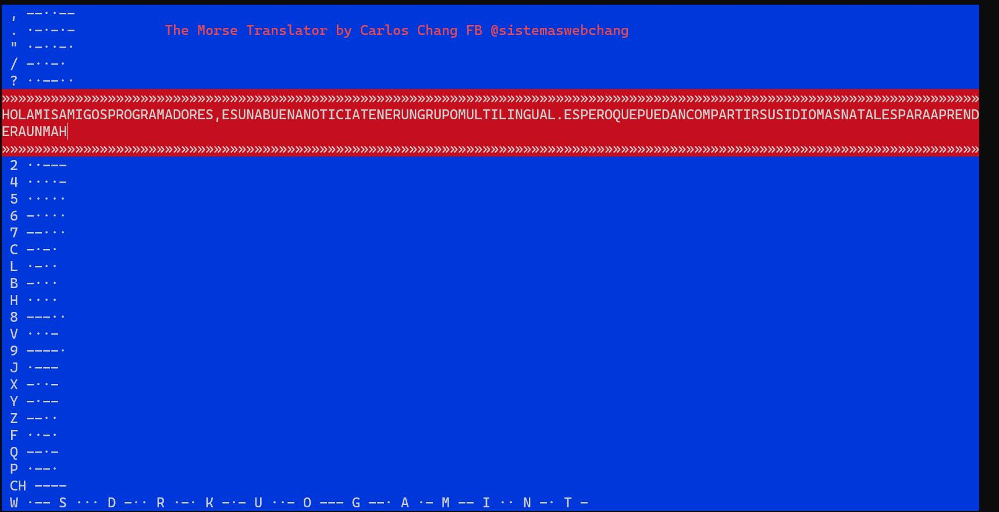

A Morse translator experiment with C# and BASIC as flavor.

Thank you Aaron West, 
Great samples 

JavaScript with sound by Aaron West

https://tallpeak.github.io/

TinyBasic version by Lee Bradley

http://primepuzzle.com/not.just.tiny.c/demorse.tc

Other 

https://github.com/gitcnd/MorseLED/blob/master/MorseLED.cpp

Tiny Basic Samples

https://github.com/tgibson37/tiny-c/tree/master/SamplePrograms
